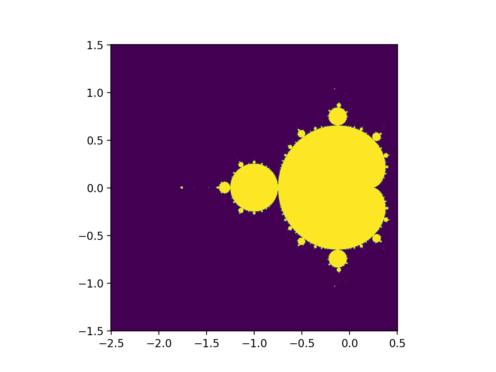

# Mandelbrot exploration

Thought it looked cool and just wanted to have some fun (after exams).

### What is the Mandelbrot set?

The Mandelbrot set is a set of complex numbers $c$ such that the iterative application of $f_c(z) = z^2 + c$, i.e. $f_c(f_c(\cdots(f_c(z))))$, does not diverge (to infinity) for a starting value of $z=0$. [Mandelbrot set (Wikipedia)](https://en.wikipedia.org/wiki/Mandelbrot_set). Side note: we can change $z \in \mathbb{C}$ to start on a different value which will give a different set. Alternatively, fix $c$ and parameterise over $z$ instead, which will give us the Julia set?

Since it is a set of complex numbers $a + bi$, we can visualise it on a 2D graph with coordinates $(a, b)$.

### Plotting of the Mandelbrot set

For starters, the escape time algorithm seems like the easiest to implement. [Plotting algorithms for the Mandelbrot set (Wikipedia)](https://en.wikipedia.org/wiki/Plotting_algorithms_for_the_Mandelbrot_set).

Basically, for each point $c \in \mathbb{C}$, we count the number of times $f_c$ is applied before the iterated value $z_{t+1} \leftarrow f_c(z_t)$ is considered to have "diverged". For points in the Mandelbrot set, they have an iteration count of $\infty$ since they would never diverge, so we need to cap the number of iterations, via a parameter like `MAX_ITERATION`.

Then, there are many ways to colour the iteration counts of the points. But... I'm just going to let Matplotlib do it for me.

### Hello world!

And this is my first ever image of the Mandelbrot set!


(Much thanks to matplotlib for the colours.)

Here's an example psuedocode:
```python
MAX_ITERATION = 100

def escape(c, z=complex(0, 0)):
    i = 0
    while abs(z) < 2 and i < MAX_ITERATION:
        z = z * z + c
        i += 1
    return i

def image(xs, ys):
    return [[escape(complex(x, y))
             for x in xs] for y in ys]

if __name__ == '__main__':
    im = image(np.linspace(-2.5,0.5,100),
               np.linspace(-1.5,1.5,100))
    plt.imshow(im)
    plt.show()
```

### Zooming...

My end in mind was a zoom animation of the Mandelbrot set, so I had to find a way to generate a zoom sequence. The zoom sequence will specify the coordinates of the window (left, right, bottom, top) of each frame of the animation.


There are many ways to do the zoom sequence, but this is the approach I had:

Specifically, given $m + 1 \in \mathbb{Z}$ number of frames, a zoom factor of $z \in \mathbb{R}$, the window width $w_0 \in \mathbb{R}$ and window centre $x_0 \in \mathbb{R}^2$ of the zeroth frame, we want to figure for the $i\text{th}$ frame, what's its window width $w_i \in \mathbb{R}$ and window centre $x_i \in \mathbb{R}$. The zoom factor determines the window width of the final, $m\text{th}$ frame, defined like so $w_m = w_0/z$.

The sequence of window widths desired ($w_0, w_1, ..., w_m$) follows a geometric progression, which can be found like so:

$$ \begin{align*}
w_i &= w_0 r^i_w \\
r_w &= 1/\sqrt[m]{z}
\end{align*} $$

The sequence of window centres desired ($x_0, x_1, ..., x_m$) is harder to find... because how do we actually move the initial window centre $x_0$ in such a way that it will "converge" to its final point $x_m$? Instead, we can think of the (euclidean) distance of each window centre $x_i$ to the final window centre $x_m$ **relative** to its window width $w_i$, which I denote $c_i = \frac{x_m - x_i}{w_i}$, and it becomes apparent that we want this sequence $(c_i)$ to follow an arithmetic progression, where the final relative distance is $c_m = 0$.

$$ \begin{align*}
c_i &= c_0 + i d_c \\
d_c &= -\frac{x_m - x_0}{w_0 m}
\end{align*} $$

Simplifying, we have $x_i = x_m - (x_m - x_0) r_w^i (1 - i / m)$.

### Finalising the zoom sequence

I eventually settle on this zoom sequence with coordinates $-0.74453986035590838011 + 0.12172377389442482241i$, after some online research ([credit](https://www.mrob.com/pub/muency/seahorsevalley.html)).


### Multiprocessing

Experimenting with various zoom sequences took quite long to render so I had various ideas to speed up the computation. Since each image (and pixel) can be computed separetely, it is an embarrassingly parallel workload.

With the help of python multiprocessing module, the frames of the animation can be split and rendered by multiple CPU cores separetely.


### GPUs/SIMD

I remembered that GPUs have much more processing cores than their CPU counterparts, so it begs the question if GPUs can be used for parallelising the workload.

Though, GPU works on the idea of SIMD (Single instruction, multiple data). But computing the escape time of each pixel require different iterations, so it isn't obvious how this could be done.

Instead, a tradeoff I thought, would be to iterate (the step update $f_c$) of all pixels/points by a constant `MAX_ITERATION` times, regardless if the point had "diverged".

Since we continue the step update $f_c$ regardless of the bailout condition, I thought about discarding the escape time algorithm and instead compute the magnitude of the resultant complex number.


Though, it is still possible to compute the escape time, by checking for the bailout condition on each iteration (for all points even though they had already bailed out).

Psuedocode of the escape time algorithm for SIMD:
```python
def step_(z, c):
    z *= z
    z += c
    return z

def escapes(n, z, xs, ys, dtype=torch.complex64):
    cs = [complex(x, y) for y in ys for x in xs]
    cs = torch.tensor(cs, dtype=dtype, device='mps')
    zs = torch.full_like(cs, z, dtype=dtype, device='mps')
    zss = accumulate(repeat(cs, n), step_, initial=zs)
    ms = sum(zs.abs() < 2 for zs in zss)
    return ms.cpu().reshape(len(ys), len(xs))
```


I repeated the same benchmark above, with pytorch (gpu) and numpy (cpu). However, as of current, pytorch does not support 128-bit complex numbers, so I had to use its 64-bit variant.


### JIT compilation with Numba

[Numba](https://numba.pydata.org/) can help to accelerate the execution of Python code by performing JIT (just in time) compilation of Python code to machine code.

```python
@numba.njit
def escape(c, z=complex(0, 0)):
    i = 0
    while abs(z) < 2 and i < MAX_ITERATION:
        z = z * z + c
        i += 1
    return i

@numba.njit
def image(xs, ys):
    return [[escape(complex(x, y))
             for x in xs] for y in ys]

if __name__ == '__main__':
    im = image(np.linspace(-2.5,0.5,1000),
               np.linspace(-1.5,1.5,1000))
    plt.imshow(im)
    plt.show()
```

Numba is very fast.


But I suppose there could be more variations I could test, and with languages apart from Python. I read online that using GPUs should actually be the fastest.

### Some renders

Some images I took along the way...




### Final render

The final zoom animation is on the release page.


The entire animation took around 4 hours to generate (on M2 air 8 cores).

### Final thoughts

This project took me too long than I actually wanted to. I thought it would have been simpler. But overall happy with the result.